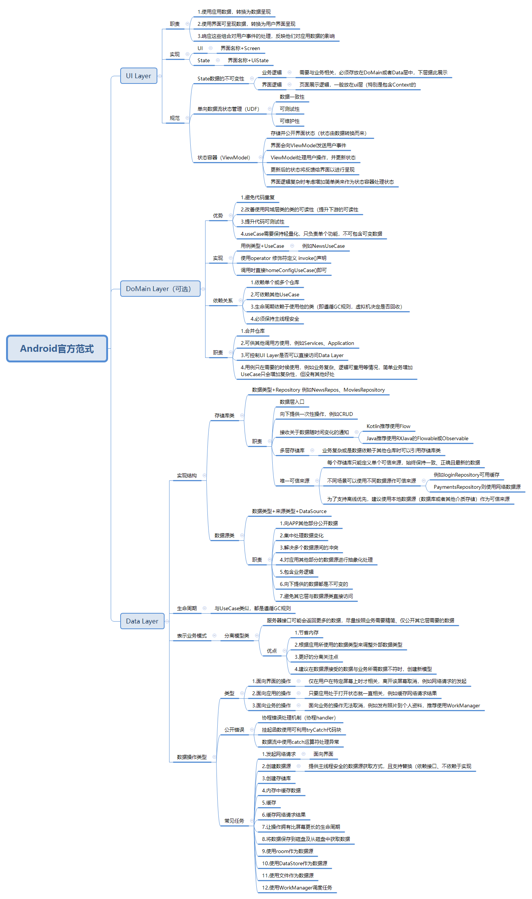
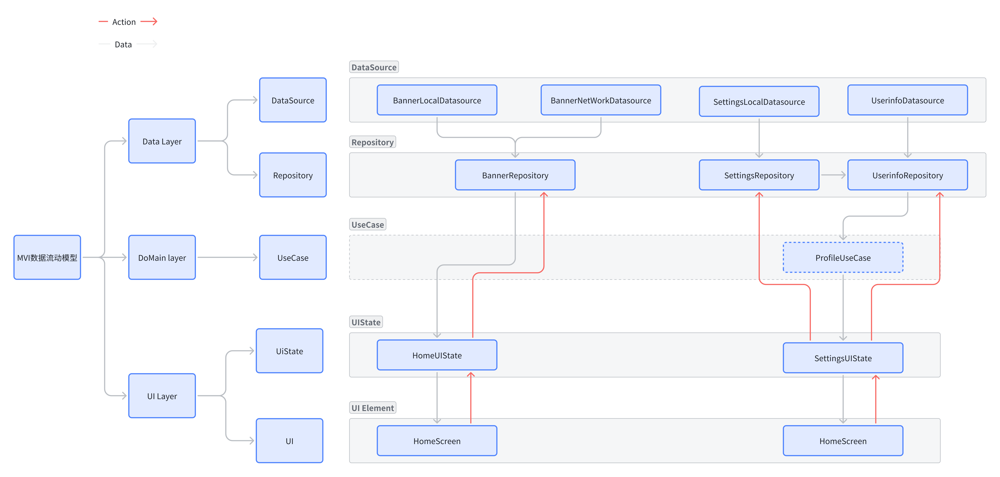

# Android 官方推荐架构思想实现，核心为数据流+多Repository+MVI

## 使用到的技术
1. Coroutine + Flow
2. Hilt
3. Compose
4. Room
5. DataSource
6. ViewModel
7. Lifecycle

## 分层职责

# BasicsProject

## 项目结构

1. Coroutine + Flow
2. Hilt
3. Compose
4. Room
5. DataSource
6. ViewModel
7. Lifecycle

## 架构流程图

## MVI or MVX？
在目前Android的架构下，不论是MVX都可以很好的融入到现在的体系中，不论下游如何实现data（domain）的实现都可以不受影响。

